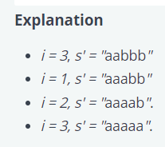

## Question 2

Give a atring s of lowercase English characters, the following operation can be performed on it any number of times.

1. Choose three consecutive characters s[i], s[i+1] and s[i+2] where (1 <= i <= s.length - 2, 1-based indexing) such that s[i] = s[i+1] and s[i+1] != s[i+2].
Replace s[i+2] with s[i]

e.g. if s = "aabc", then after the operation at i = 1, s = "aaac"

Find the maximum number of operations that can be applied to s.

Consraints:
1. 3 <= s.length <= 2 * 10^5
2. The string s only contains lowercase English letters.

Sample Case 0:
s = "aabaab"

Sample Output 0:
2

Sample Case 1:
s = "aabba"

Sample Output 1:
4

