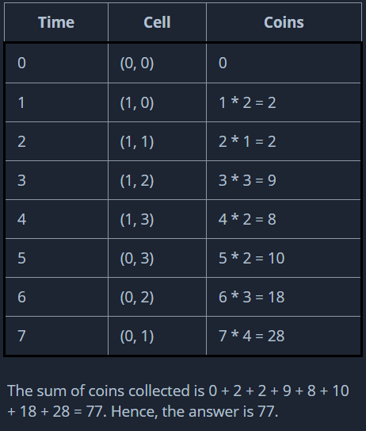

## Question 3

A new online game is gaining popularity in Hackerland. It is based on a 2 x n matrix coins, where coins[i][j] = initial number of coins.

The number of coins in each cell is increasing over time. More precisely, at some time k, the number of coins in the cell (i, j) is k * coins[i][j].

A player has to start from the point (0, 0) at time t = 0 and in a single unit of time is allowed to move to any neighbouring cell. A player Collects all the coins in the cell they visit and each cell must be visited exactly once.

Given the initial number of coins in the matrix, coins, find the maximum possible number of coins that a player can collect.

Constraints:
1. 1 <= n <= 10^5
2. 1 <= coins[i][j] <= 10^5

Sample Case 0:
n = 2
coins = [[1, 3], [4, 2]]

Sample Output 0:
19

Sample Case 1:
n = 4
coins  = [[1, 4, 3, 2], [2, 1, 3, 2]]

Sample Output 1:
77

