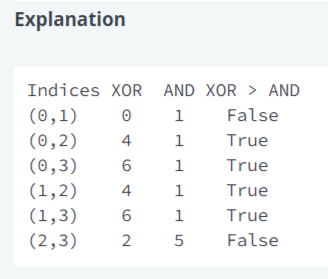

## Red or Blue

There are a number of cities in a row, and there are 2 bus lines that go between them. They both visit all cities in order, but one may take longer than the other to go between any 2 cities. Starting on or moving to the Blue line takes a certain amount of extra time. There is no extra time required to start on or move to the Red line. Determine the minimum cost to move from the city to each of the cities.

Constraints:
1. 2 <= n <= 2* 10^5
2. 1 <= red[i], blue[i], blueCost <= 10^9

Sample Case 0:
red = [5]
blue = [3]
blueCost = 1

Sample Output 0:
0
4

Sample Case 1:
red = [40, 20]
blue = [30, 25]
blueCost = 5

Sample Output 1:
0
35
55

