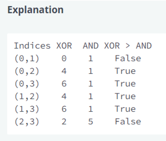

## Dominating XOR

For an array arr of n positive integers, count the unordered pairs (i, j) (0 <= i < j < n) where (arr[i] ^ arr[j]) > (arr[i] & arr[j]).

Constraints:
1. 1 <= n <= 10^5
2. 1 <= arr[i] < 2^30

Sample Case 0:
n = 4
arr = [1, 1, 5, 7]

Sample Output 0:
4

Sample Case 1:
n = 3
arr = [1, 7, 2]