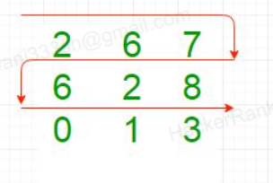

## Common Path

John is given two 2-D arrays of different sizes (m1*n1 and m2* n2). The traversal of each element in the array is illustrated below:

He needs to determine the common path(s) having the maximum length traversed in both thee arrays. Can you help John figure it out?

Constraints:
1. All the matrix elements are signed 32-bit integers
2. 1 <= m1*n1, m2*n2 <= 1000 (Number of matrix elements of each matrix)
3. m1, n1, m2, n2 need not be the same

Sample Test 1:
m1 = 3, n1 = 3
    2 6 7
    6 2 8
    0 1 3
m2 = 2, n2 = 3
    -1 8 6
     2 8 7

Sample Output 1:
6 7 8 2

Expalanation:
Path traversed by first array: 2 6 7 8 2 6 0 1 3
Path traversed by second array: -1 8 6 7 8 2
Maximum common path traversed: 6 7 8 2

